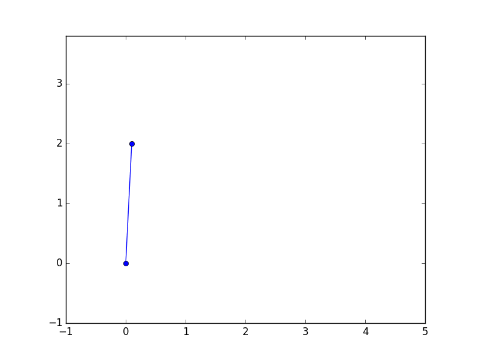
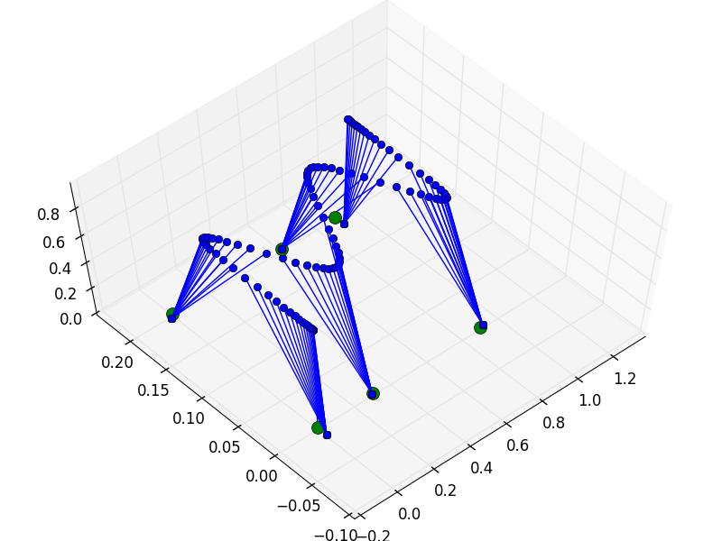
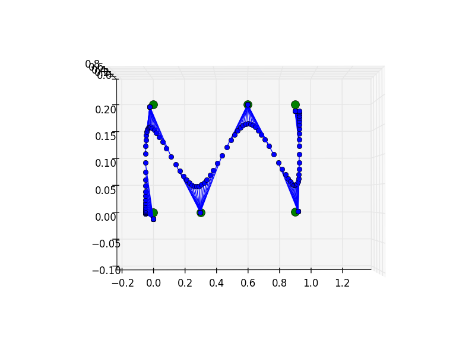

# Humanoid robot algorithms

## Linear Inverted Pendulum Simulation 2D

This script is very simple Linear Inverted Pendulum simulation 2D.

### Walk on a flat ground

### Climb stairs

## Linear Inverted Pendulum Simulation 3D

### Step Parameter

|n   |   1|   2|   3|   4|   5|
|:---|:---|:---|:---|:---|:---|
|s_x| 0.0| 0.3| 0.3| 0.3| 0.0|
|s_y| 0.2| 0.2| 0.2| 0.2| 0.2|

### Result

